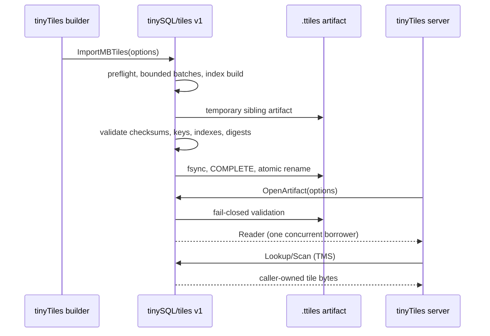
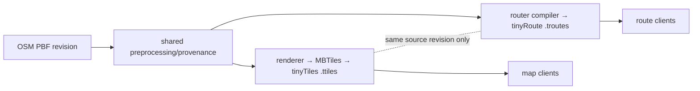

# tinySQL integration API

tinyTiles depends only on the versioned public package
`github.com/SimonWaldherr/tinySQL/tiles`. It does not import a tinySQL
`internal/` package, decode pager files, or rely on the concrete reader
implementation. This is the boundary to keep when this directory moves to
`github.com/Karte-Bayern/tinyTiles`.

## v1 contract

```go
import tiles "github.com/SimonWaldherr/tinySQL/tiles"

result, err := tiles.ImportMBTiles(ctx, "region.mbtiles", "region.ttiles", &tiles.ImportOptions{
    Schema:         tiles.SchemaNormalized,
    BatchSize:      2_048,
    MaxMemoryBytes: 256 << 20,
    MinFreeBytes:   8 << 30,
})

info, err := tiles.ValidateArtifact(ctx, result.ArtifactPath)
reader, err := tiles.OpenArtifact(ctx, result.ArtifactPath, tiles.OpenOptions{
    MaxMemoryBytes: 32 << 20,
})
defer reader.Close()

tile, found, err := reader.Lookup(ctx, tiles.Key{Z: 12, X: 2184, Y: 1381})
```

`tiles.Reader` is the serving contract. `tiles.MetadataScanner` is the
additive companion returned by `OpenArtifact`; it streams complete MBTiles
metadata in stable name order without materializing table rows. On supported native targets,
`ValidateArtifact` and `OpenArtifact` use only the published paged artifact;
they neither link nor open SQLite. Only `ImportMBTiles` requires the optional
`sqliteimport` build tag because its source is an SQLite MBTiles file.
Accordingly, `make build-reader-cli` and `make build-server` are verified
SQLite-free build targets; the full `tinytiles` builder binary retains the tag.

| Need | Public API | Contract |
|---|---|---|
| Immutable publication | `ImportMBTiles` | bounded batches, preflight resource gates, full validation and atomic publish |
| Promotion audit | `ValidateArtifact` | checksums, marker, schema, keys, indexes and logical data digests |
| Open serving handle | `OpenArtifact` | validates before returning a reader; one reader is one concurrent borrower |
| Tile read | `Lookup` / `LookupFunc` | exact TMS key, caller-owned byte slice |
| Spatial read | `Scan` | bounded, ordered TMS range; callback errors propagate |
| Metadata | `Metadata` | exact metadata-name lookup |
| Metadata scan | `MetadataScanner.ScanMetadata` | ordered, callback-based metadata walk; no tile-table scan |
| Immutable description | `Info` | deep-copied semantic artifact information, no pager internals |

`ArtifactInfo` intentionally presents schema, tables, checksums, logical
digests, coordinate system and semantic physical-index names. It does not
publish `storage.DB`, PagedIndex pages, raw manifest maps, or a concrete
reader struct as part of tinyTiles' compatibility promise.

The package's `APIVersion` is `1`. tinySQL can add fields and new functions in
that API version, but incompatible behavior requires a new public package
contract. tinyTiles should pin a released tinySQL version when it leaves this
worktree; the current `replace` directive is development-only.

## Why the SQL driver is not the tile hot path

The public `driver` package remains useful for general tinySQL databases:
`Open`, `OpenWithConfig`, `OpenFile` and `OpenWithDB(*tinysql.DB)` are its
stable embedding surface. The latter now names the public `*tinysql.DB` type,
not an `internal/storage` type.

It is deliberately not the primary tile-serving API:

- `database/sql` adds SQL parsing, parameter binding, row scanning and BLOB
  conversion to a lookup that is naturally a typed `(z, x, y)` operation;
- an artifact reader must fail closed after checksum/index validation, whereas
  a generic database handle suggests mutable, arbitrary table access;
- a `tiles.Reader` can document payload ownership, TMS convention, range
  ordering and a per-reader cache budget directly;
- a future read-only SQL/audit adapter can be added separately without making
  it a latency or compatibility dependency of every tile request.

The historical root-level `tinysql.OpenMBTilesReader` and
`OpenMBTilesArtifact` APIs remain compatibility APIs during migration. New
tinyTiles code must use `tiles.OpenArtifact`; it never needs access to a
tinySQL `internal` package.

## Lifecycle and ownership



The `tinytiles.Dataset` package pools independent `tiles.Reader` values. A
reader is closed only after it has been returned from service; a tile byte
slice may safely outlive the reader call but applications should not retain
unbounded payloads. Dataset eagerly opens every reader and reads copied
metadata at startup, so an unreadable artifact cannot emerge only under load.

## tinyTiles application API

The tinyTiles repository presents three APIs, all backed only by the public
tinySQL package above:

| Surface | Import path / binary | Intended owner |
|---|---|---|
| Library | `github.com/Karte-Bayern/tinyTiles` | Go application that owns lookup, cache and lifecycle policy |
| HTTP adapter | `github.com/Karte-Bayern/tinyTiles/server` | Existing `http.ServeMux` application that wants standard XYZ, TileJSON or sync routes |
| Binary | `tinytiles-server` | Small dedicated artifact process with external edge policy |

`tinytiles.Open(ctx, path, OpenOptions)` returns a concurrent `Dataset`.
Its `LookupTMS`/`ScanTMS` APIs are TMS, while `LookupXYZ` and the
compatibility `GetTileXYZ` adapter flip the Y value for XYZ requests. The
adapter implements Karte.Bayern's current narrow reader contract exactly:

```go
type tileReader interface {
    GetTileXYZ(z, x, yXYZ int) ([]byte, error)
    Metadata() (map[string]string, error)
    Close() error
}

dataset, err := tinytiles.Open(ctx, artifact, tinytiles.OpenOptions{Readers: 8})
var reader tileReader = dataset
```

Missing values return `tinytiles.ErrTileNotFound`, intentionally compatible
with `database/sql.ErrNoRows`. This makes the current Karte.Bayern handler,
its cache and TileJSON implementation usable without coupling tinyTiles to its
application package. The generic `server.XYZHandler()` is available when the
route should instead be mounted directly.

## Routing: useful later, separate now

Routing is technically a good future workload for tinySQL's immutable,
validated artifact model, but it should **not** be folded into tinyTiles.
Raster/vector tiles describe rendering output; they do not retain the directed
topology, access rules, turn restrictions, edge geometry or profile-specific
weights needed for correct routing.

The recommended shape is a separate `tinyRoute` project and a separate
versioned artifact (for example `.troutes`), built from the same PBF revision
but published independently:



Before implementing it, a routing artifact needs its own public contract for:

- directed edges/nodes, per-mode access and OSM turn restrictions;
- snapping/spatial lookup, edge geometries and deterministic route results;
- profile/version identifiers and weights (distance, time, elevation, etc.);
- a large-graph query strategy such as CH, MLD or a customizable hierarchy;
- independent checksums, resource preflight, atomic publication and rollback;
- `RouteReader`/`RouteRequest`/`RouteResult` APIs, rather than SQL in the
  request hot path.

The only shared contract should initially be a small, immutable build-revision
link in provenance. Do not make a `.ttiles` deployment depend on a route graph
being present, and do not expose tile tables as a routing data model. This
keeps map serving production-ready while the much larger correctness problem of
routing can mature independently.
