# Architecture in diagrams

The same material as [architecture.md](./architecture.md), drawn. Read that one
for the invariants and the prose; read this one to see the shapes.

The diagrams are Mermaid, which GitHub renders inline, as do most Markdown
viewers with Mermaid support.

## The stack

Each layer knows only about the one below it.

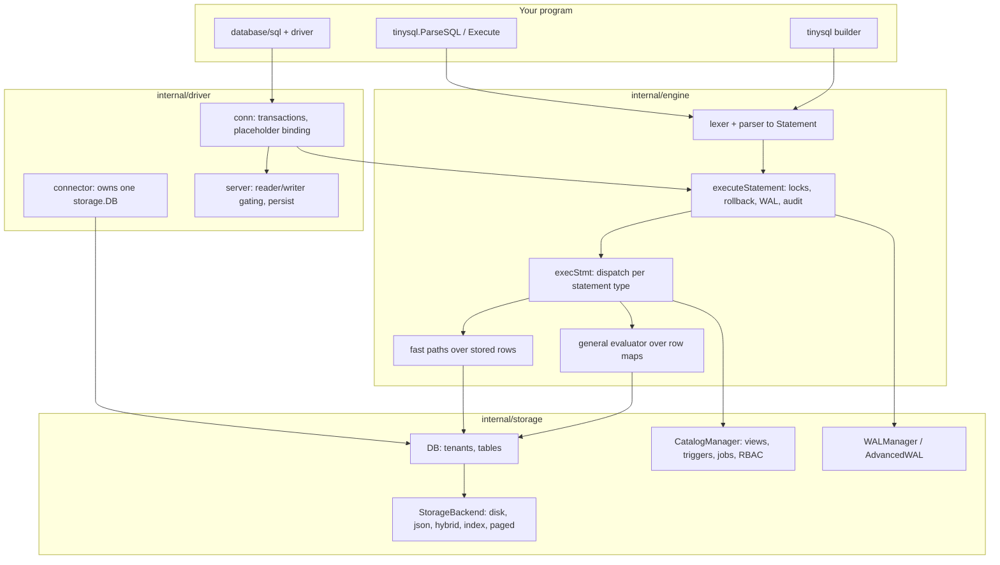

The engine touches the filesystem in exactly one place: the SQL-callable
`file()` and `http()` functions in `io_functions.go`. That is a real capability
to be aware of, not an oversight — it gives any statement the process's own
filesystem and network reach.

## Core types

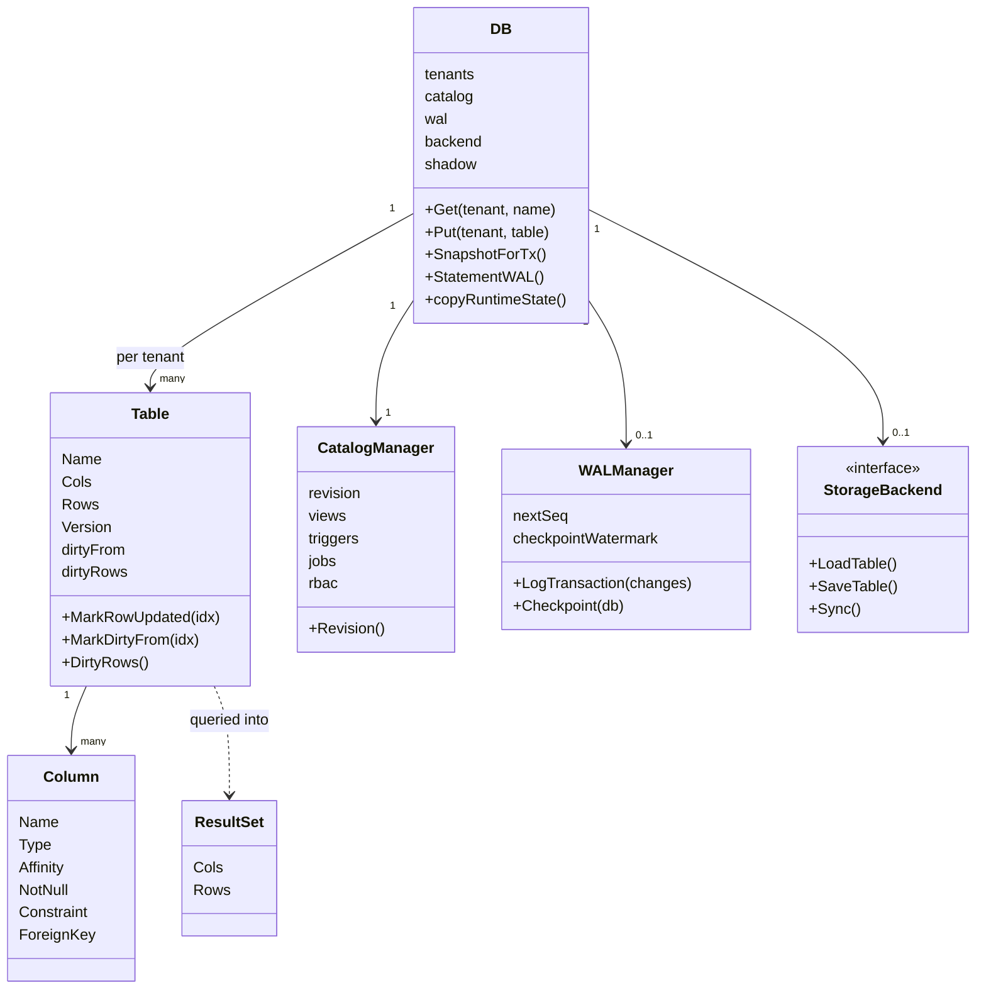

A `Table` stores rows as `[][]any` — no per-row struct, no page layout. Values
stay native Go values from storage through evaluation into the `ResultSet`, so a
read needs no unmarshalling. That single choice explains most of tinySQL's read
performance and most of its memory profile.

## An autocommit write, end to end

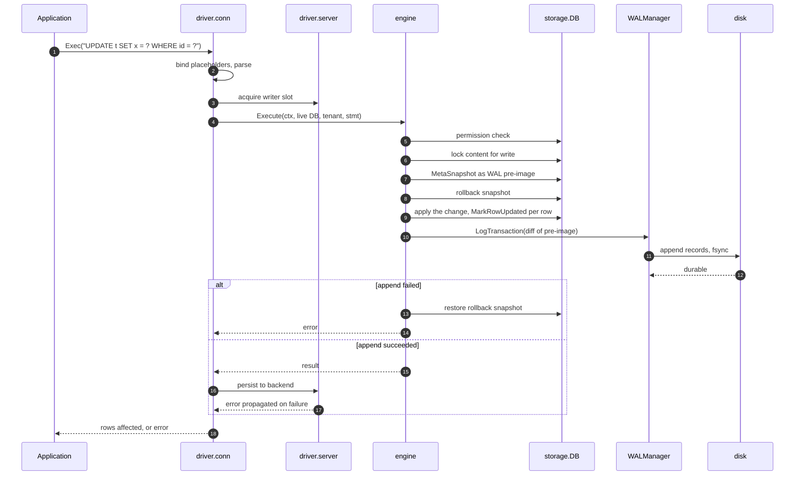

Two properties are visible here. The log is written **before** the statement is
acknowledged, and a failed append restores the rollback point so memory never
holds a change the log does not. And a persistence failure becomes the
statement's error — acknowledging a write that is not durable is the one outcome
an application cannot detect for itself.

## A transaction

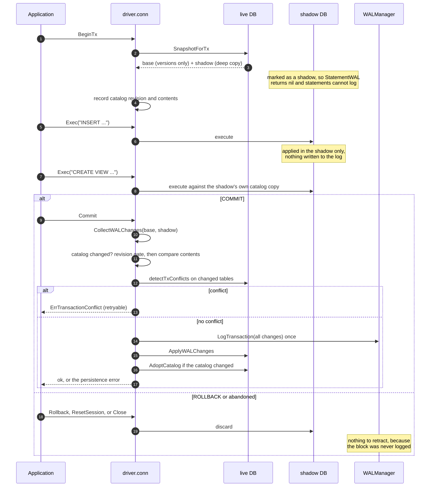

The shadow is why a rolled-back transaction leaves nothing behind. When
statements inside a transaction *did* log as they ran, each one landed on disk
looking committed, and recovery resurrected rows a `ROLLBACK` had discarded.

`ModeAdvancedWAL` records row operations as they happen, so it cannot simply stay
silent. It instead joins one ambient WAL transaction per SQL transaction, which
recovery replays only if a matching commit record exists.

## Connection transaction state

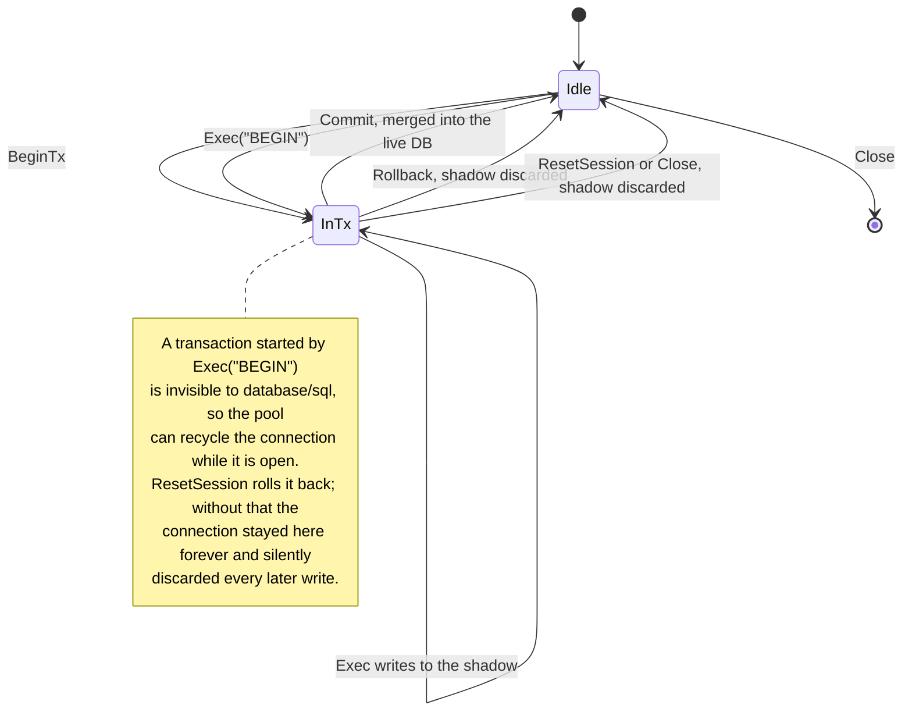

## Query execution: fast path or general path

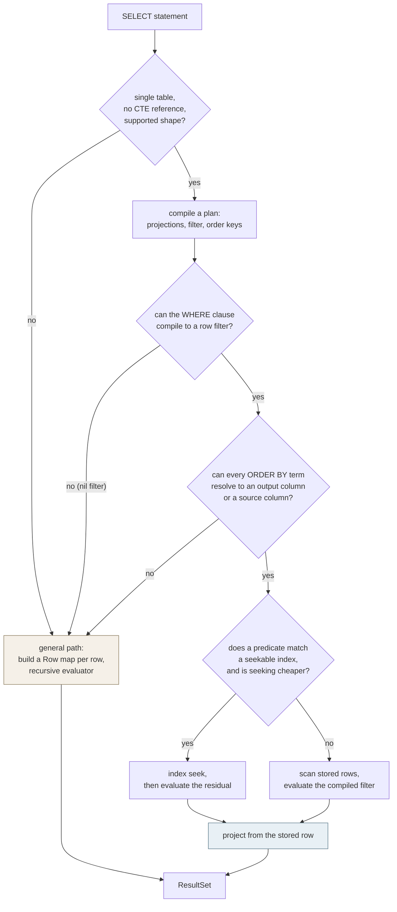

A fast path must **decline, never guess**. Every builder returns a plan plus an
`ok`, or a nil filter, and anything it does not fully understand falls through to
the general path. A fast path that returns a subtly wrong answer is the one
failure mode a test cannot catch unless it already knows the right answer.

## Write-ahead log records

One statement or one transaction becomes a `BEGIN`, one record per changed
table, and a `COMMIT`. Recovery applies a transaction's records only when it
reaches that commit record.

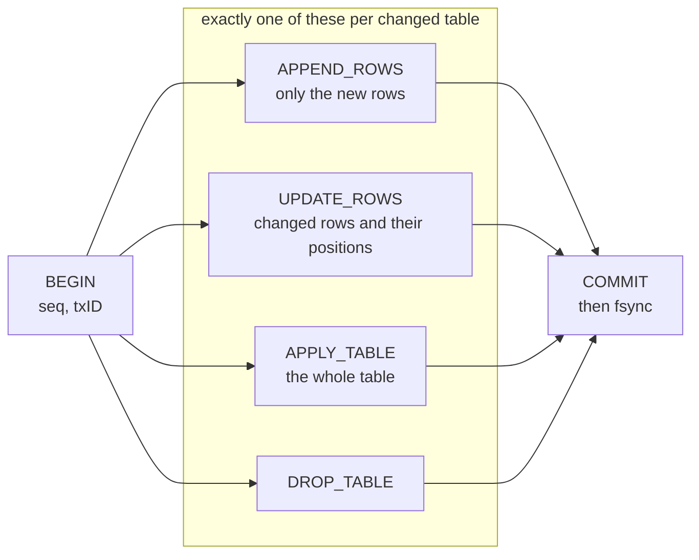

Which record a change becomes is decided by the dirty tracking on the table:

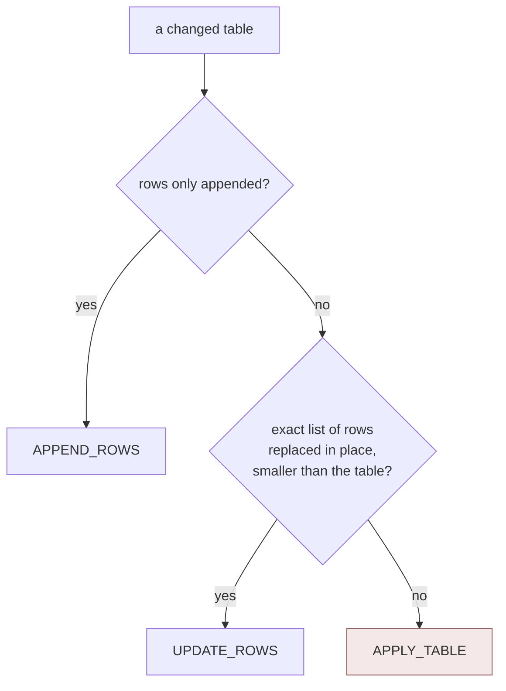

`APPLY_TABLE` is the fallback, and the fallback direction is deliberate. A
mutation that cannot describe its shape gives up the hint, and the cost is one
oversized record. Trusting a hint that is wrong would cost data instead. Before
`UPDATE_ROWS` existed, changing one row of a 10,000-row table serialized and
fsynced all 10,000 of them.

## Recovery

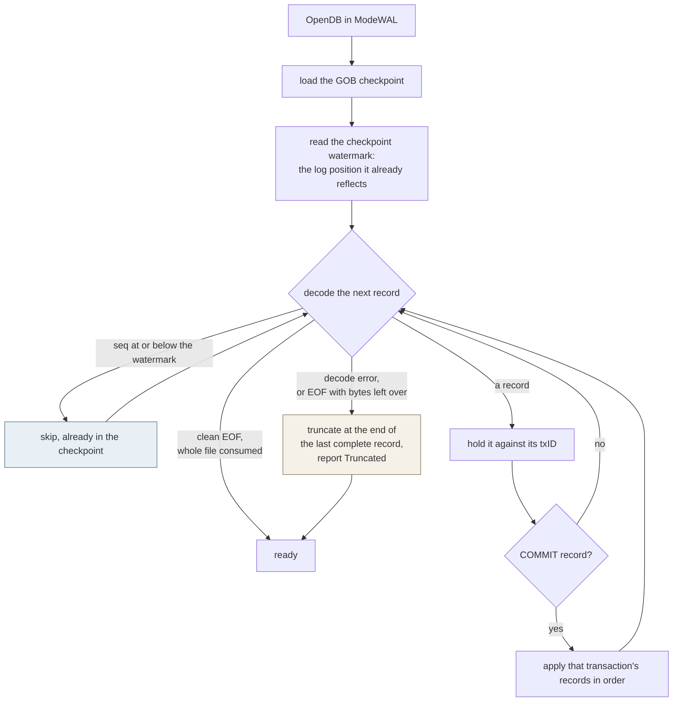

Both shaded branches exist because of a specific failure. Without the watermark,
a crash between writing a checkpoint and truncating the log replayed
already-checkpointed deltas and **duplicated committed rows**. Without treating a
damaged tail as recoverable, a single bad byte made the database **permanently
unopenable** even though everything before it had recovered fine — and a trailing
run of zero bytes reads as a clean EOF, so anything appended after it would have
been invisible to every later recovery.

## Choosing a storage mode

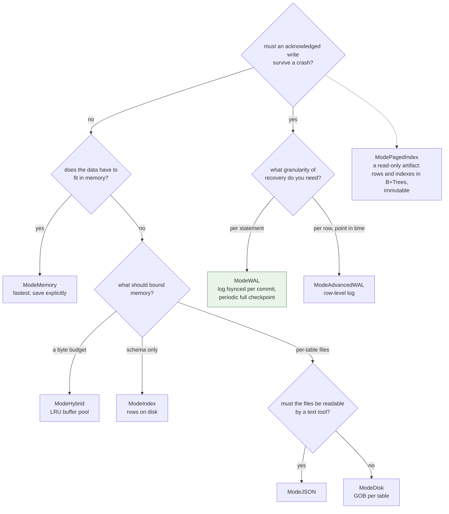

`ModeWAL` is the mode to compare against SQLite when an acknowledged write must
survive a crash. Compare equivalent flush tiers: `wal_sync=normal` performs an
ordinary fsync per commit and corresponds to SQLite `synchronous=FULL` without
`fullfsync`; the default `wal_sync=full` uses the strongest available OS flush
(including `F_FULLFSYNC` on macOS) and must be compared with SQLite
`fullfsync=ON`. [BENCHMARKS.md](../BENCHMARKS.md) contains both tiers.

## Where a change belongs

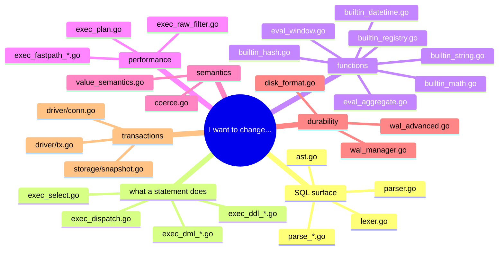
